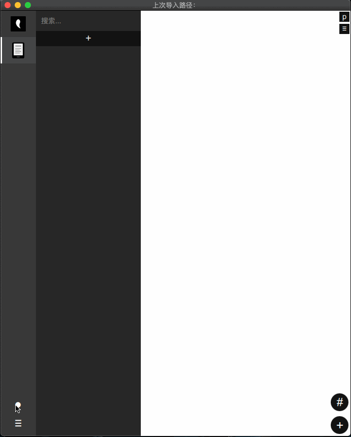

# xxmoon摘月——信息收藏、Kindle/微信读书/豆瓣阅读笔记管理

## 前言
信息收藏、Kindle/微信读书/豆瓣阅读笔记管理，把这些相似的需求融合到了一个软件里，没必要分别用几个软件，并且操作上非常符合常打键盘的人，键盘鼠标不断切换比较打断不流畅。

## 特点
### 全键盘操作
只有少部分操作需要点鼠标，如移动、加解密确定、导入导出、文件夹删改，其它都可键盘操作。

### 纯文本编辑（类似Markdown语法）
为什么不直接用Markdown，这个更简洁，支持Markdown不支持的，如左中右对齐。

### 图片模式
在列表回车会进入图片预览模式，J下一张，K上一张，这样可以快速预览当前列表所有图片，再回车会调动本地图片编辑器编辑当前图片。

### 无缝连接外部编辑器，如VI,Notepad,Sublime等（可自定义）
如果要用其它更强大的编辑器，直接"Ctrl Alt Enter"将当前文档转到配置好的编辑器中编辑，那边保存，这边也同步保存。不仅文本可以，图片也可以利用外部编辑软件编辑。

### 单机版
目前是单机版，可能之后会加个服务端部署在局域网用来和其它机器同步数据。目前我自己是用git手动来同步数据的。

### AES加密
加密后就变成一托乱码了，加密前要确保记得密码，否则数据找不回。
另外，分类的加密只是在打开时需要密码，只是界面锁，并不对真实数据进行加密。

### 导出pdf/html/xm/站点
.xm是本软件自有格式，支持格式文本、代码高亮、动静图，目前只有本软件可以打开这个格式。导出站点就是生成一个带主索引页和详情页的静态网站，样式可以自己去改。用这个来写博客也是个不错的选择。

### 其它功能
能与自定义python或其它脚本相结合来组成定时器、命令面板。

## 日常工作流

所有操作: https://github.com/senlinmuvs/xxmoon/wiki

服务端：https://github.com/senlinmuvs/xmserver
