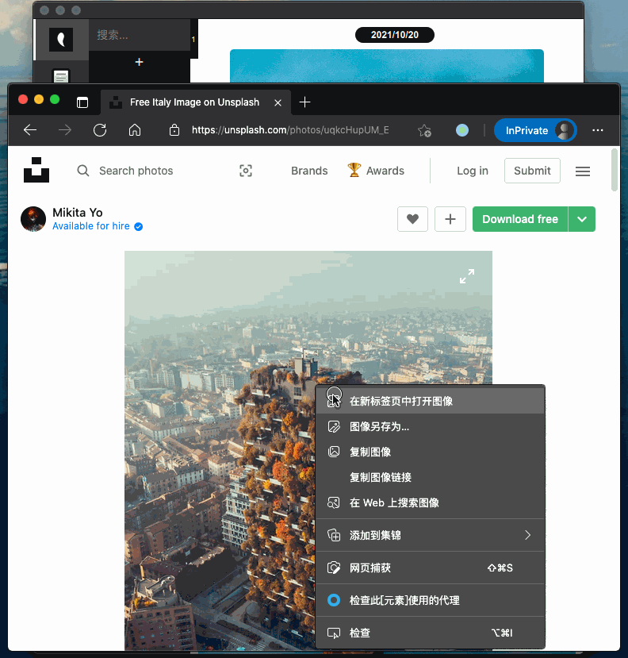
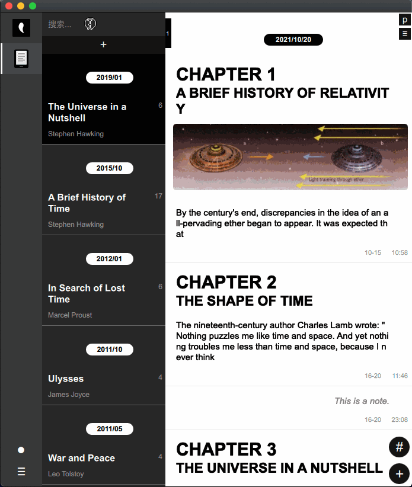
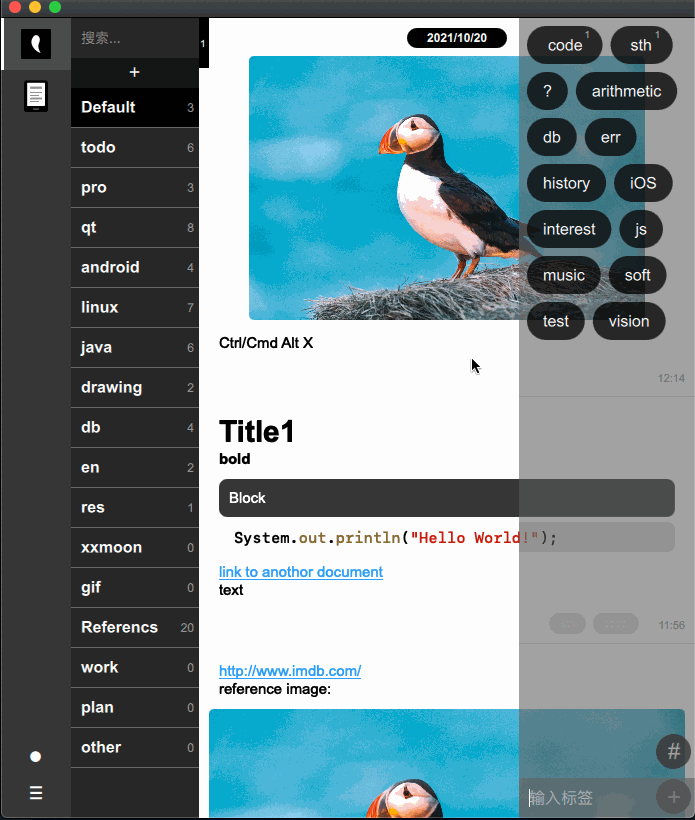
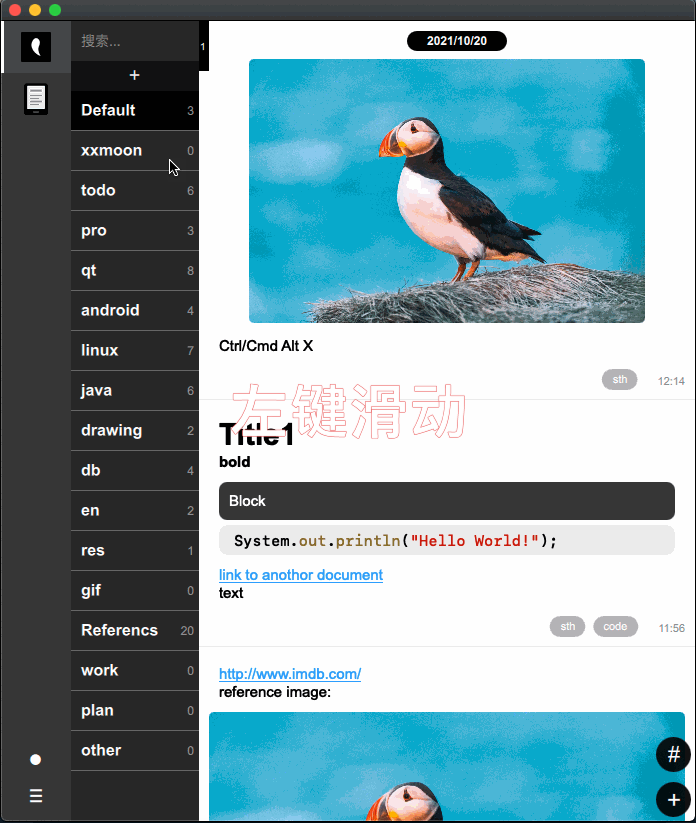

# 信息收藏、笔记与电子书标注管理

## 前言
信息收藏、笔记与电子书的标注管理应该融合到一个软件里会更好，相似的需求，分别用几个软件，不大好。并且操作上最好符合常打键盘的人用就好了，键盘鼠标不断切换操作比较打断不流畅。并且最好就是单机版的，不要联网，数据自己管理在本地，可以一个文件夹打包带走。

## 特点
### 全键盘操作
只有少部分操作需要点鼠标，如移动、加解密确定、导入导出、文件夹删改，其它都可键盘操作。

### 纯文本编辑（类似Markdown语法）
为什么不直接用Markdown，这个更简洁。

### 图片模式
在列表回车会进入图片预览模式，J下一张，K上一张，这样可以快速预览当前列表所有图片，再回车会调动本地图片编辑器编辑当前图片。

### 无缝连接外部编辑器，如VI,Notepad,Sublime等（可自定义）
如果要用其它更强大的编辑器，可以的，直接"Ctrl Alt Enter"将当前文档转到配置好的编辑器中编辑，那边保存，这边也同步保存。不仅文本可以，图片也可以利用外部编辑软件编辑。

### 单机版
目前是单机版，可以和手机在局域网互动，没有太必要的功能的话不会加联网操作。
(手机版是TODO，谁愿意可加入开发)

### AES加密
加密后就变成一托乱码了，加密前要确保记得密码，否则数据找不回的。

### 导出pdf/html/xm/站点
.xm是本软件自有格式，支持格式文本、代码高亮、动静图，目前只有本软件可以打开这个格式。导出站点就是生成一个带主索引页和详情页的静态网站，样式可以自己去改。用这个来写博客也是个不错的选择。

## 日常工作流

## 后语
优先macOS的开发，上了苹果App Store，Windows版的会有滞后，看起来可能会不如苹果版的，可在官网下载。这个软件会一直更新，这也是我自己用得比较多的软件。
(已下架苹果市场了)
